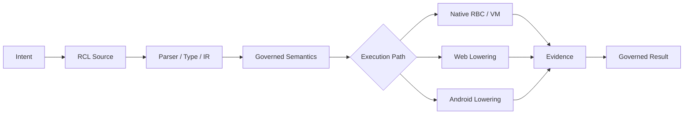
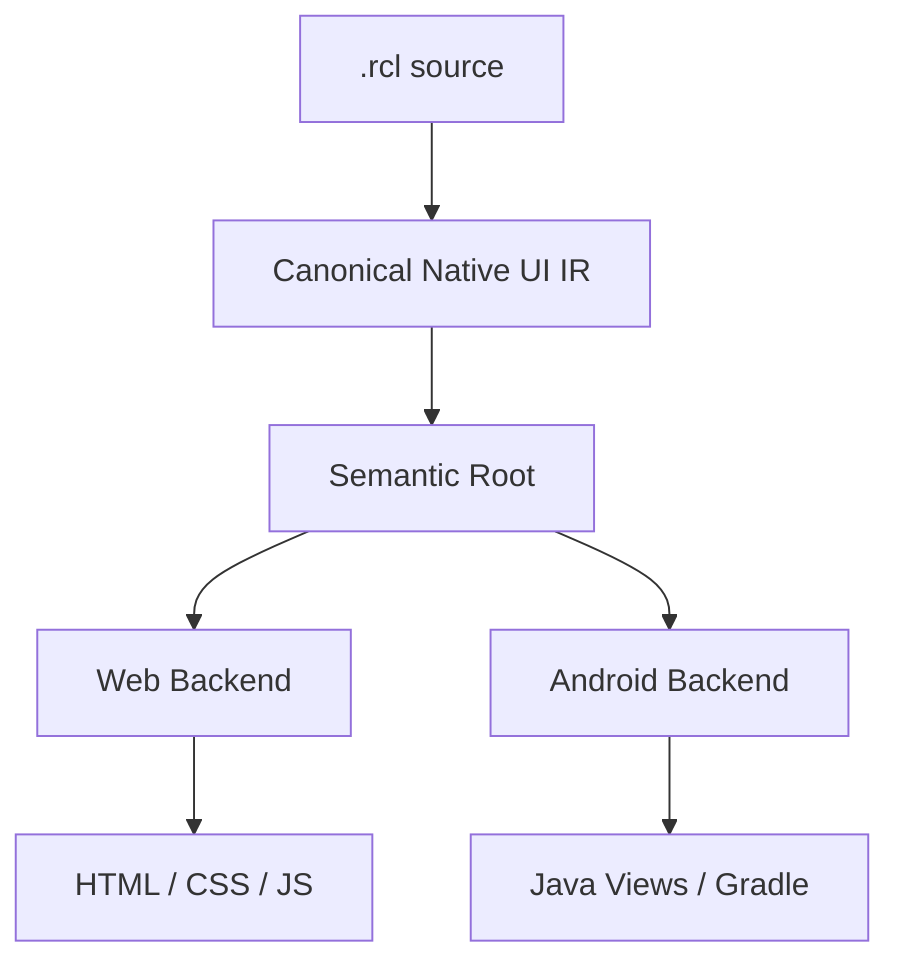
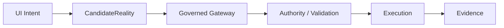
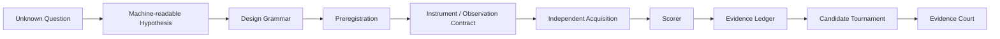
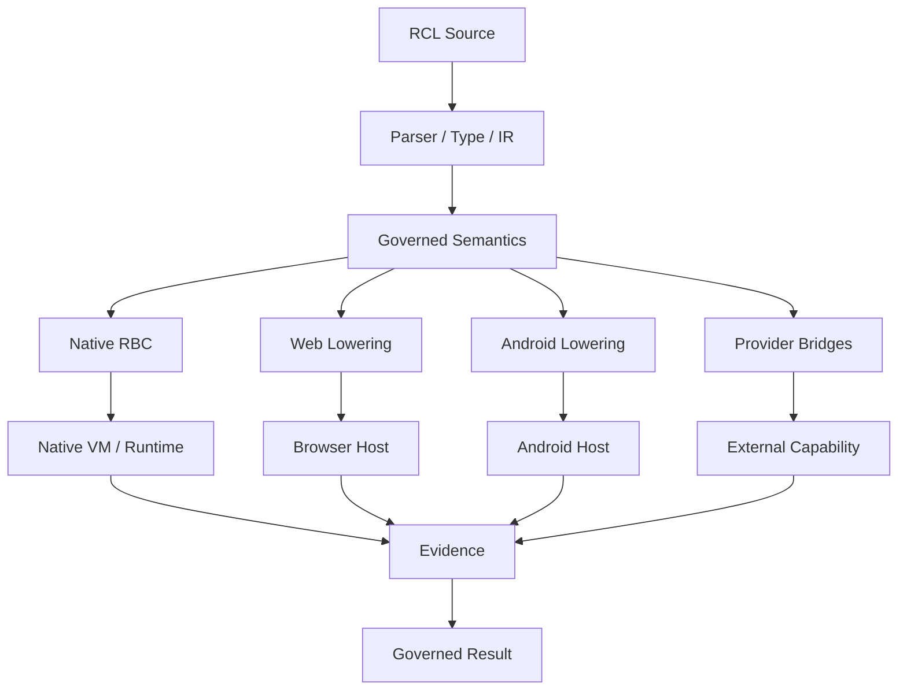

<div align="center">

# RCL — Reality Compiler Language

**A self-hosting programming language and compiler for governed state transitions, evidence-bound execution, and cross-platform software lowering.**

[English](README.md) · [简体中文](README.zh-CN.md) · [5-minute Quick Start](GETTING_STARTED.md) · [Website / Playground](https://rcl-rncs-mcp.vercel.app) · [Current Status](CURRENT-STATUS.md)

[](LICENSE)
[](package.json)
[](CURRENT-STATUS.md)
[](CURRENT-STATUS.md)

</div>

> RCL is an evidence-bearing, permission-constrained programming language, compiler, native VM, provider runtime, and verification toolchain.

RCL is built around one core idea:

```text
intent
→ explicit state and authority
→ candidate transition
→ validation / invariants
→ lowering or execution
→ evidence
→ governed result
```



RCL currently has a self-hosted native-core compiler path, a native VM, Web and Android lowering paths, a platform-neutral Native UI semantic model, and a permanent cross-environment stress harness.

It does **not** claim to be a universal programming language today. The repository instead defines a falsifiable process for testing how far that objective can be pushed.

---

# Start here if you are a programmer

If the repository looks too abstract on first glance, do this before reading architecture documents.

## 1. Clone and install

```bash
git clone https://github.com/xingxuling/RCL.git
cd RCL
npm install
```

Node.js 22+ is required for the JavaScript/reference toolchain.

## 2. Run the smallest real program

```bash
npm run demo
```

That command runs [`examples/hello-reality.rcl`](examples/hello-reality.rcl):

```rcl
reality FirstLight {
  facet world.greeting : Text = "unformed"

  subject founder {
    facet awareness : Number = 0
    warrant world.write on world
  }

  emergence hello {
    cause founder
    when world.greeting == "unformed"
    needs world.write on world
    alter world.greeting <- "Hello, reality."
    alter founder.awareness <- founder.awareness + 1
    preserve founder.awareness >= 0
    witness "rcl:first-light"
  }

  foresee hello
  realize hello
}
```

Read it as:

```text
initial state
+ actor
+ authority
+ precondition
+ proposed mutation
+ invariant
+ evidence
+ commit
```

The interesting part is not the greeting. It is that **who may change what, under which conditions, while preserving which invariants, is explicit in the program**.

## 3. Try the native path

```bash
npm run build:native
npm run demo:native
```

Then try explicit bytecode compilation + native execution:

```bash
npm run demo:bytecode
```

## 4. Full 5-minute walkthrough

For the rest of the runnable path — Web state, Native UI, Android, bytecode and self-host verification — use:

**→ [`GETTING_STARTED.md`](GETTING_STARTED.md)**

Chinese version:

**→ [`GETTING_STARTED.zh-CN.md`](GETTING_STARTED.zh-CN.md)**

---

## Why RCL?

Most programming systems begin from operations: call a function, mutate state, send a request.

RCL makes the transition itself a first-class object:

- **who** is acting;
- **what authority** permits the action;
- **which state** may change;
- **which invariants** must remain true;
- **what evidence** proves the transition;
- **what happens when validation fails**.

A minimal governed transition looks like this:

```rcl
reality Counter {
  facet app.count : Number = 0

  subject user {
    warrant app.write on app
  }

  emergence increment {
    cause user
    needs app.write on app
    alter app.count <- app.count + 1
    preserve app.count >= 0
    witness "counter:increment"
  }
}
```

This says more than “increment a number”. It declares a subject, authority, proposed state change, invariant, and witness.

---

## Learn RCL by example

Recommended order:

| Example | What it shows | Source |
|---|---|---|
| First Light | minimal state + authority + transition | [`examples/hello-reality.rcl`](examples/hello-reality.rcl) |
| Governed Web state | guards, mutation, invariants, evidence | [`examples/universal-stress/k02-complete-web-app.rcl`](examples/universal-stress/k02-complete-web-app.rcl) |
| Native UI counter | state, derived values, bindings, layout, styles, events | [`examples/native-ui/counter.rcl`](examples/native-ui/counter.rcl) |
| In-app navigation | routes and atomic UI-local navigation | [`examples/native-ui/navigation.rcl`](examples/native-ui/navigation.rcl) |
| Device adaptation | width profiles and cross-platform adaptive layout intent | [`examples/native-ui/device-adaptation.rcl`](examples/native-ui/device-adaptation.rcl) |
| Android vertical slice | governed application state lowered toward Android | [`examples/universal-stress/k03-native-android-app.rcl`](examples/universal-stress/k03-native-android-app.rcl) |

### Native UI example

```rcl
reality NativeUICounter {
  ui CounterApp {
    state count : Number = 0
    derived count_label : Text = "计数：" + count

    view Root {
      layout vertical {
        width fill
        height intrinsic
        gap 12
        padding 24
        align stretch
        distribute start
      }

      text CounterText {
        bind value <- count_label
      }

      action IncrementButton {
        label "增加"
        on activate {
          set count <- count + 1
        }
      }
    }
  }
}
```

The full example also contains lifecycle, themes, styles, accessibility labels and reset behavior.

### Navigation example

```rcl
navigation {
  initial home
  route home -> HomeScreen
  route settings -> SettingsScreen
}

on activate {
  set visits <- visits + 1
  navigate settings
}
```

### Device adaptation example

```rcl
adaptation {
  default compact
  profile compact min_width 0 max_width 599
  profile expanded min_width 600
}

view Root {
  layout vertical {
    width fill
    height intrinsic
  }

  adapt expanded layout horizontal
}
```

The current candidate maps this same semantic intent to Web width-profile behavior and Android `screenWidthDp`-based layout selection.

Suggested reading path:

```text
hello-reality.rcl
→ K02 governed Web state
→ Native UI Counter
→ Navigation
→ Device Adaptation
→ K03 Android vertical slice
→ selfhost/compiler-core.rcl
→ CURRENT-STATUS.md
```

Browse all runnable and evidence-bearing examples under [`examples/`](examples/).

---

## What is verified today?

The package baseline remains **`v0.94.0-alpha.1`**. Exact current evidence lives in [`CURRENT-STATUS.md`](CURRENT-STATUS.md).

| Area | Current state |
|---|---|
| RCL-authored general compiler | **Verified** |
| Native-core compiler fixed point `C0 == C1 == C2` | **Verified** |
| Native VM / compiler path | **Present and tested** |
| Whole-language runtime self-hosting | **Not claimed** |
| Complete Web vertical slice | **8/9 stress gates evidenced; AI generation gate open** |
| Android project / APK generation | **Verified build path** |
| Android installed-device behavior | **Not yet verified in the recorded campaign** |
| Native UI semantic root shared by Web / Android | **Verified for current candidate slices** |
| Native UI navigation + width-profile adaptation | **Candidate, self-hosted slices verified** |
| Universal Program Stress | **Active; most of the 400-cell matrix intentionally remains unknown** |

### Self-hosting

```text
RCL compiler source
      ↓
     C0
      ↓
compile compiler with itself
      ↓
     C1
      ↓
compile again
      ↓
     C2

C0 == C1 == C2
```

RCL distinguishes **native-core self-hosting** from **whole-language runtime self-hosting**. The former is verified; the latter is not claimed.

---

## Native UI Genome

RCL is developing a platform-neutral UI semantic layer rather than treating Web and Android as unrelated frontends.

Current candidate semantics include:

- state and derived expressions;
- lifecycle and restore policy;
- themes and style rules;
- recursive view trees;
- bindings;
- local events with typed / inferred parameters;
- governed `reality-transaction` declarations;
- fixed sizing intent;
- in-app navigation;
- available-width adaptation profiles.



A real Chrome run has verified width-profile adaptation for the current candidate, and the Android backend has produced a real Gradle debug APK build from the same semantic root.

Important boundary: Android installation, configuration-change behavior, interaction, and performance on a real device are still unverified in the recorded campaign.

See:

- [`docs/ui-native-genome/current-state-audit.md`](docs/ui-native-genome/current-state-audit.md)
- [`docs/ui-native-genome/native-ui-architecture.md`](docs/ui-native-genome/native-ui-architecture.md)
- [`docs/ui-native-genome/evidence-ledger.md`](docs/ui-native-genome/evidence-ledger.md)

---

## Governed UI events

RCL intentionally separates local UI mutation from reality-affecting actions.

```text
UI-local event
→ local candidate state
→ local validation
→ local commit
```

A governed reality action follows a different path:



The UI layer cannot directly commit external reality. Unknown rule references and mixed-authority handlers fail closed in the verified candidate slices.

---

## Universal Program Stress

RCL's primary research harness is a permanent **20 × 20 = 400** environment / program matrix.

Each evidence-bearing cell is checked through nine **non-compensatory** gates:

1. `EXPRESS`
2. `COMPILE`
3. `LOWER`
4. `EXECUTE`
5. `CORRECT`
6. `ROBUST`
7. `PERFORMANCE`
8. `AI_GENERATE`
9. `EVIDENCE`

A missing required gate blocks the cell. A failed required gate fails the cell. No weighted score can hide a missing hard requirement.

Every permanent cell also has a stable campaign identity from `K001` through `K400`. Run `npm run evidence:k400` to rebuild the consolidated fail-closed report. Current audited coverage is `0 PASS / 7 BLOCKED / 393 UNTESTED`, so K400 remains `INCOMPLETE`.

### Current killer-task frontier

| Task | Target | Coverage mode | Current result |
|---|---|---|---|
| **K01** | Self-hosting compiler | native semantic | `BLOCKED (8/9)` |
| **K02** | Complete Web application | lowered execution | `BLOCKED (8/9)` |
| **K03** | Native Android application | lowered execution | `BLOCKED` |
| **K04** | 2D game | next campaign | not yet claimed |

See [`docs/RCL_UNIVERSAL_PROGRAM_STRESS_TEST_v0.1.md`](docs/RCL_UNIVERSAL_PROGRAM_STRESS_TEST_v0.1.md) and the current [`K400 completion campaign`](docs/K400_COMPLETION_CAMPAIGN_v0.1.md).

---

## Capability modes

RCL uses three explicit modes so integration is not confused with language ownership.

### `native-semantic`

RCL owns the relevant computational semantics in its language, IR, or runtime model.

### `lowered-execution`

RCL owns the relevant semantics and deliberately lowers them into another execution substrate such as a browser, Android runtime, SQL engine, GPU runtime, or other backend organ.

### `opaque-delegation`

RCL delegates the hard problem to an external tool or language and receives a result.

Opaque delegation may be useful, but it does **not** count as native RCL capability.

---

## Frontier research: compiling unknowns into experiments

RCL also contains an experimental Frontier line for turning unknown-law or unknown-knowledge questions into explicit, falsifiable experiment contracts.



Sandbox success validates protocol behavior under constructed worlds; it does **not** establish new physics, external information channels, or other unsupported real-world conclusions.

---

## Architecture



---

## Useful commands

```bash
npm install
npm run demo
npm run build:native
npm run demo:native
npm run demo:bytecode
npm run build:selfhost-compiler
npm run verify:selfhost-fixedpoint
npm run verify:selfhost-examples
```

For the guided explanation, use [`GETTING_STARTED.md`](GETTING_STARTED.md).

---

## Project map

```text
src/                         language / runtime / reference implementation
selfhost/                    RCL-authored compiler sources + fixed-point artifact
native/                      native VM / compiler / provider boundary
examples/                    runnable examples and evidence fixtures
tests/                       conformance, regression and stress tests
scripts/                     build, verification and stress runners
docs/                        architecture, campaigns, evidence and governance
CURRENT-STATUS.md            human-readable current authority snapshot
VERSION-CONTRACT.json        machine-readable release / capability boundary
COMPONENT-VERSIONS.json      governed component identities
```

---

## Contributing

RCL is public and contributions are welcome.

Good contribution targets include:

- minimal reproducible failures in existing semantics;
- missing primitives revealed by the Universal Program Stress matrix;
- backend lowering improvements that preserve RCL-owned semantics;
- differential tests between reference, self-hosted, and native paths;
- performance work on the self-host compiler / VM;
- Native UI resources, accessibility, and real-device verification;
- independent AI-generation / repair evaluations for K01 and K02.

Please keep one principle in mind: **a stronger claim requires stronger evidence, not stronger wording.**

---

## Non-claims

This repository currently does **not** claim that:

- RCL can write every possible program;
- the whole language runtime is self-hosted;
- every Foundation domain is native;
- Android device execution is already verified for the current campaign;
- a generated artifact is equivalent to a verified runtime result;
- Frontier sandbox experiments establish new natural laws or external physical effects.

The point of the project is to make those boundaries explicit and testable.

---

## License

Apache-2.0. See [`LICENSE`](LICENSE).
