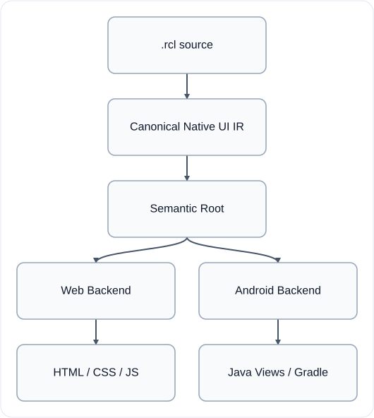
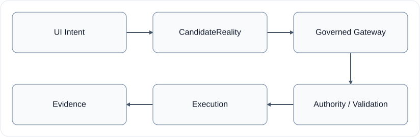
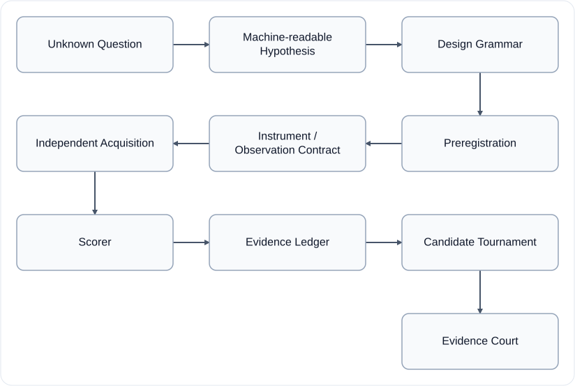
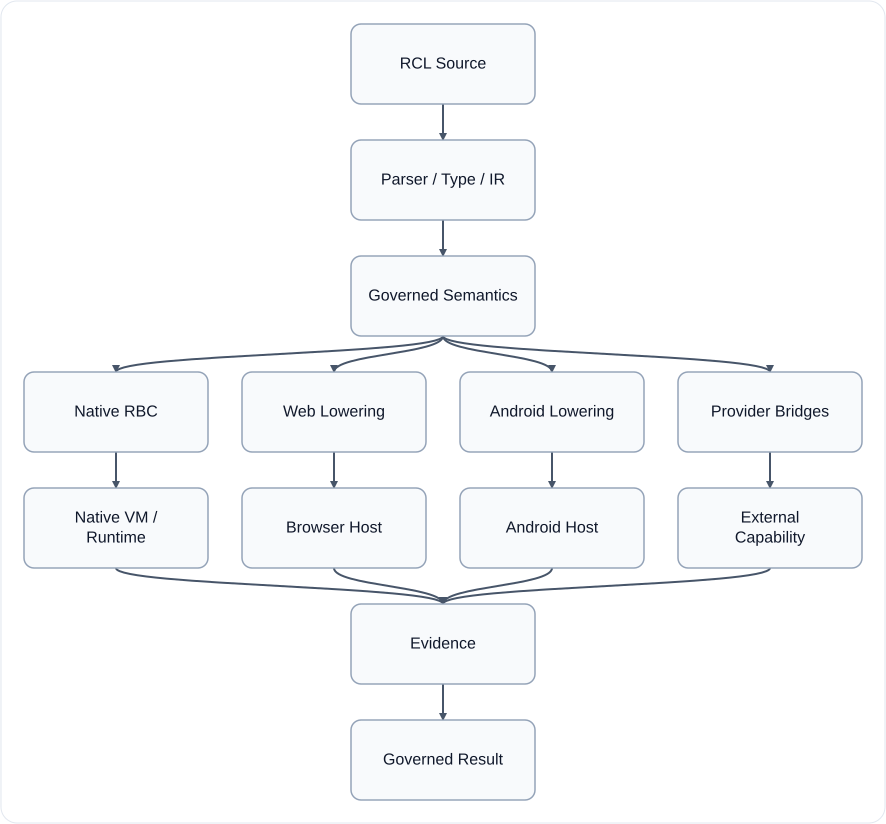

<div align="center">

# RCL v1.0.0 — Reality Compiler Language

**A programming language that makes permissions, state changes, and evidence part of the program.**

[English](README.md) · [简体中文](README.zh-CN.md) · [5-minute Quick Start](GETTING_STARTED.md) · [Website / Playground](https://rcl-rncs-mcp.vercel.app) · [Current Status](CURRENT-STATUS.md)

[](LICENSE)
[](package.json)
[](CURRENT-STATUS.md)
[](CURRENT-STATUS.md)

</div>

RCL (Reality Compiler Language) is an open-source language for writing programs whose state changes must obey explicit rules: **who can act, what may change, which conditions must hold, and what evidence records the result**.

This repository contains the language implementation, an RCL-authored native-core compiler, a native bytecode VM, Web/Android backends, and a verification toolchain. Canonical source: `xingxuling/RCL@main`.

## Why RCL?

- **Put authority next to behavior.** Subjects, warrants, guards, mutations, and invariants are language constructs. A state transition declares its permission and validation requirements instead of leaving that contract implicit in surrounding application code.
- **Make execution inspectable.** Transitions produce witnesses and evidence; the toolchain uses artifact and semantic-state roots to check results across implementations. Evidence remains tied to the profile actually tested.
- **Keep semantics across execution targets.** RCL owns the state and authority model while native bytecode, Web, and Android paths provide different execution environments. The candidate Native UI model shares an IR and semantic root across Web/Android backends.
- **Verify the compiler with itself.** The native-core compiler is written in RCL and has a recorded byte-identical `C0 == C1 == C2` fixed point. This is compiler self-hosting, not a claim that the entire runtime is self-hosted.

RCL is useful to explore permission-aware application state, auditable automation, and language/runtime research. Version 1.0 stabilizes the core language, native state-root protocol, public CLI and installable source toolchain. Research extensions retain their individual evidence and maturity profiles.

[Quick start](#quick-start) · [Examples](#learn-rcl-by-example) · [Current maturity](#what-is-verified-today) · [Architecture](#architecture) · [Contributing](#contributing)

---

## Version 1.0

The native VM and `rcl run` default to `rcl.semantic-state-root.v2`, using exact finite binary64 encoding for final states and transaction roots. Historical native v1 receipts remain verifiable through explicit algorithm selection. The `runReality` reference API preserves its distinct `rcl.reference-state-root.v0.6` default; pass `stateRootAlgorithm` for cross-runtime v2 execution. See the [stable contracts](docs/v1.0/language-contract.md), [root protocol](docs/v1.0/semantic-state-root-v2.md) and [release acceptance](docs/v1.0/acceptance.md).

## Quick start

Requirements: Git, Node.js 20+, and npm. Start with the JavaScript/reference runtime from source:

### 1. Clone and install

```bash
git clone https://github.com/xingxuling/RCL.git
cd RCL
npm install
```

### 2. Run a complete program

```bash
npm run demo
```

That command runs [`examples/hello-reality.rcl`](examples/hello-reality.rcl):

```rcl
reality FirstLight {
  facet world.greeting : Text = "unformed"

  subject founder {
    facet awareness : Number = 0
    warrant world.write on world
  }

  emergence hello {
    cause founder
    when world.greeting == "unformed"
    needs world.write on world
    alter world.greeting <- "Hello, reality."
    alter founder.awareness <- founder.awareness + 1
    preserve founder.awareness >= 0
    witness "rcl:first-light"
  }

  foresee hello
  realize hello
}
```

Read it as:

```text
initial state
+ actor
+ authority
+ precondition
+ proposed mutation
+ invariant
+ evidence
+ commit
```

The interesting part is not the greeting. It is that **who may change what, under which conditions, while preserving which invariants, is explicit in the program**.

### 3. Build and run the native path

On Unix-like systems, the native build uses `make`, a C11 compiler, and OpenSSL/libcrypto development files; see [`native/Makefile`](native/Makefile). Windows uses the separate [`build-native-windows.mjs`](scripts/build-native-windows.mjs) toolchain path. Native build prerequisites are separate from the reference quick start.

```bash
npm run build:native
npm run demo:native
```

Then try explicit bytecode compilation + native execution:

```bash
npm run demo:bytecode
```

### 4. Continue learning

For the rest of the runnable path — Web state, Native UI, Android, bytecode and self-host verification — use:

**→ [`GETTING_STARTED.md`](GETTING_STARTED.md)**

Chinese version:

**→ [`GETTING_STARTED.zh-CN.md`](GETTING_STARTED.zh-CN.md)**

---

## What is verified today?

Canonical `main` is **`v1.0.0`**, merged in [PR #262](https://github.com/xingxuling/RCL/pull/262). The [local release verification](docs/v1.0/verification.json) records 1683 passing tests, 0 failures, 2 skipped cases, Windows/Linux installation checks and 41 self-host verification stages. Remote deployment and npm publication are tracked separately. Capability evidence and maturity profiles live in [`CURRENT-STATUS.md`](CURRENT-STATUS.md).

| Area | Current state |
|---|---|
| RCL-authored general compiler | **Verified** |
| Native-core compiler fixed point `C0 == C1 == C2` | **Verified** |
| Native VM / compiler path | **Present and tested** |
| Whole-language runtime self-hosting | **Not claimed** |
| Complete Web vertical slice | **PASS (9/9) for the bounded K02 profile** |
| Android project / APK generation | **Verified build path** |
| Android installed execution | **Bounded K03 API 35 emulator profile passes; physical-device validation is not claimed** |
| Native UI semantic root shared by Web / Android | **Verified for current candidate slices** |
| Native UI navigation + width-profile adaptation | **Candidate, self-hosted slices verified** |
| Universal Program Stress | **Active; most of the 400-cell matrix intentionally remains unknown** |

### Self-hosting

```text
RCL compiler source
      ↓
     C0
      ↓
compile compiler with itself
      ↓
     C1
      ↓
compile again
      ↓
     C2

C0 == C1 == C2
```

RCL distinguishes **native-core self-hosting** from **whole-language runtime self-hosting**. The former is verified; the latter is not claimed.

---

## Learn RCL by example

Recommended order:

| Example | What it shows | Source |
|---|---|---|
| First Light | minimal state + authority + transition | [`examples/hello-reality.rcl`](examples/hello-reality.rcl) |
| Governed Web state | guards, mutation, invariants, evidence | [`examples/universal-stress/k02-complete-web-app.rcl`](examples/universal-stress/k02-complete-web-app.rcl) |
| Native UI counter | state, derived values, bindings, layout, styles, events | [`examples/native-ui/counter.rcl`](examples/native-ui/counter.rcl) |
| In-app navigation | routes and atomic UI-local navigation | [`examples/native-ui/navigation.rcl`](examples/native-ui/navigation.rcl) |
| Device adaptation | width profiles and cross-platform adaptive layout intent | [`examples/native-ui/device-adaptation.rcl`](examples/native-ui/device-adaptation.rcl) |
| Android vertical slice | governed application state lowered toward Android | [`examples/universal-stress/k03-native-android-app.rcl`](examples/universal-stress/k03-native-android-app.rcl) |

### Native UI example

```rcl
reality NativeUICounter {
  ui CounterApp {
    state count : Number = 0
    derived count_label : Text = "计数：" + count

    view Root {
      layout vertical {
        width fill
        height intrinsic
        gap 12
        padding 24
        align stretch
        distribute start
      }

      text CounterText {
        bind value <- count_label
      }

      action IncrementButton {
        label "增加"
        on activate {
          set count <- count + 1
        }
      }
    }
  }
}
```

The full example also contains lifecycle, themes, styles, accessibility labels and reset behavior.

### Navigation example

```rcl
navigation {
  initial home
  route home -> HomeScreen
  route settings -> SettingsScreen
}

on activate {
  set visits <- visits + 1
  navigate settings
}
```

### Device adaptation example

```rcl
adaptation {
  default compact
  profile compact min_width 0 max_width 599
  profile expanded min_width 600
}

view Root {
  layout vertical {
    width fill
    height intrinsic
  }

  adapt expanded layout horizontal
}
```

The current candidate maps this same semantic intent to Web width-profile behavior and Android `screenWidthDp`-based layout selection.

Suggested reading path:

```text
hello-reality.rcl
→ K02 governed Web state
→ Native UI Counter
→ Navigation
→ Device Adaptation
→ K03 Android vertical slice
→ selfhost/compiler-core.rcl
→ CURRENT-STATUS.md
```

Browse all runnable and evidence-bearing examples under [`examples/`](examples/).

---

## Native UI Genome

RCL is developing a platform-neutral UI semantic layer rather than treating Web and Android as unrelated frontends.

Current candidate semantics include:

- state and derived expressions;
- lifecycle and restore policy;
- themes and style rules;
- recursive view trees;
- bindings;
- local events with typed / inferred parameters;
- governed `reality-transaction` declarations;
- fixed sizing intent;
- in-app navigation;
- available-width adaptation profiles.



[Editable diagram source](docs/readme-diagrams/native-ui-genome.mmd).

A real Chrome run has verified width-profile adaptation for the current candidate, and the Android backend has produced a real Gradle debug APK build from the same semantic root.

The bounded K03 transaction UI has recorded API 35 emulator installation, interaction, rotation/restore, and performance evidence. This does not establish physical-device validation or verification of every Native UI candidate; see [`CURRENT-STATUS.md`](CURRENT-STATUS.md).

See:

- [`docs/ui-native-genome/current-state-audit.md`](docs/ui-native-genome/current-state-audit.md)
- [`docs/ui-native-genome/native-ui-architecture.md`](docs/ui-native-genome/native-ui-architecture.md)
- [`docs/ui-native-genome/evidence-ledger.md`](docs/ui-native-genome/evidence-ledger.md)

---

## Governed UI events

RCL intentionally separates local UI mutation from reality-affecting actions.

```text
UI-local event
→ local candidate state
→ local validation
→ local commit
```

A governed reality action follows a different path:



[Editable diagram source](docs/readme-diagrams/governed-ui-en.mmd).

The UI layer cannot directly commit external reality. Unknown rule references and mixed-authority handlers fail closed in the verified candidate slices.

---

## Universal Program Stress

RCL's primary research harness is a permanent **20 × 20 = 400** environment / program matrix.

Each evidence-bearing cell is checked through nine **non-compensatory** gates:

1. `EXPRESS`
2. `COMPILE`
3. `LOWER`
4. `EXECUTE`
5. `CORRECT`
6. `ROBUST`
7. `PERFORMANCE`
8. `AI_GENERATE`
9. `EVIDENCE`

A missing required gate blocks the cell. A failed required gate fails the cell. No weighted score can hide a missing hard requirement.

Every permanent cell also has a stable campaign identity from `K001` through `K400`. Run `npm run evidence:k400` to rebuild the consolidated fail-closed report. The current recorded coverage is `24 PASS / 0 BLOCKED / 376 UNTESTED` (maturity `U3`), so K400 remains `INCOMPLETE`. These are bounded evidence profiles, not a claim that whole program or environment families are solved. K233 closes a bounded configurable two-Dense-layer General MLP profile; later Tensor/Autodiff candidates retain their separate evidence boundaries in [`CURRENT-STATUS.md`](CURRENT-STATUS.md).

### Current killer-task frontier

| Task | Target | Coverage mode | Current result |
|---|---|---|---|
| **K01** | Self-hosting compiler | native semantic | `PASS (9/9), bounded profile` |
| **K02** | Complete Web application | lowered execution | `PASS (9/9), bounded profile` |
| **K03** | Native Android application | lowered execution | `PASS (9/9), bounded emulator profile` |
| **K04** | 2D game | lowered execution | `PASS (9/9), bounded deterministic runtime` |

See [`docs/RCL_UNIVERSAL_PROGRAM_STRESS_TEST_v0.1.md`](docs/RCL_UNIVERSAL_PROGRAM_STRESS_TEST_v0.1.md), the current [`K400 completion campaign`](docs/K400_COMPLETION_CAMPAIGN_v0.1.md), and the [`K08 RCL-Native AI campaign`](docs/K08_RCL_NATIVE_AI_CAMPAIGN_v0.1.md).

---

## Capability modes

RCL uses three explicit modes so integration is not confused with language ownership.

### `native-semantic`

RCL owns the relevant computational semantics in its language, IR, or runtime model.

### `lowered-execution`

RCL owns the relevant semantics and deliberately lowers them into another execution substrate such as a browser, Android runtime, SQL engine, GPU runtime, or other backend organ.

### `opaque-delegation`

RCL delegates the hard problem to an external tool or language and receives a result.

Opaque delegation may be useful, but it does **not** count as native RCL capability.

---

## Frontier research: compiling unknowns into experiments

RCL also contains an experimental Frontier line for turning unknown-law or unknown-knowledge questions into explicit, falsifiable experiment contracts.



[Editable diagram source](docs/readme-diagrams/frontier-experiments-en.mmd).

Sandbox success validates protocol behavior under constructed worlds; it does **not** establish new physics, external information channels, or other unsupported real-world conclusions.

---

## Architecture



[Editable diagram source](docs/readme-diagrams/architecture.mmd).

---

## Useful commands

```bash
npm install
npm run demo
npm run build:native
npm run demo:native
npm run demo:bytecode
npm run build:selfhost-compiler
npm run verify:selfhost-fixedpoint
npm run verify:selfhost-examples
```

For the guided explanation, use [`GETTING_STARTED.md`](GETTING_STARTED.md).

---

## Project map

```text
src/                         language / runtime / reference implementation
selfhost/                    RCL-authored compiler sources + fixed-point artifact
native/                      native VM / compiler / provider boundary
examples/                    runnable examples and evidence fixtures
tests/                       conformance, regression and stress tests
scripts/                     build, verification and stress runners
docs/                        architecture, campaigns, evidence and governance
CURRENT-STATUS.md            human-readable current authority snapshot
VERSION-CONTRACT.json        machine-readable release / capability boundary
COMPONENT-VERSIONS.json      governed component identities
```

---

## Contributing

RCL is public and contributions are welcome.

Good contribution targets include:

- minimal reproducible failures in existing semantics;
- missing primitives revealed by the Universal Program Stress matrix;
- backend lowering improvements that preserve RCL-owned semantics;
- differential tests between reference, self-hosted, and native paths;
- performance work on the self-host compiler / VM;
- Native UI resources, accessibility, and real-device verification;
- broader independent AI-generation / repair evaluations beyond the frozen K01 and K02 profiles.

Please keep one principle in mind: **a stronger claim requires stronger evidence, not stronger wording.**

---

## Non-claims

This repository currently does **not** claim that:

- RCL can write every possible program;
- the whole language runtime is self-hosted;
- every Foundation domain is native;
- Android physical-device execution or every Native UI candidate is already verified;
- a generated artifact is equivalent to a verified runtime result;
- Frontier sandbox experiments establish new natural laws or external physical effects.

The point of the project is to make those boundaries explicit and testable.

---

## License

Apache-2.0. See [`LICENSE`](LICENSE).
