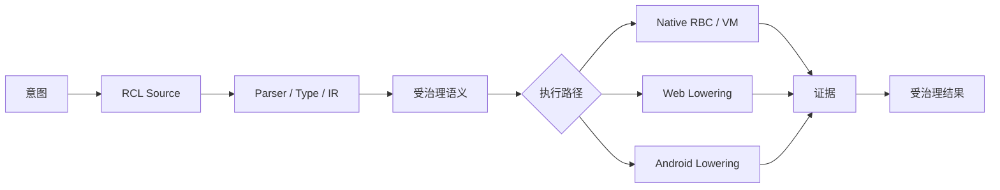
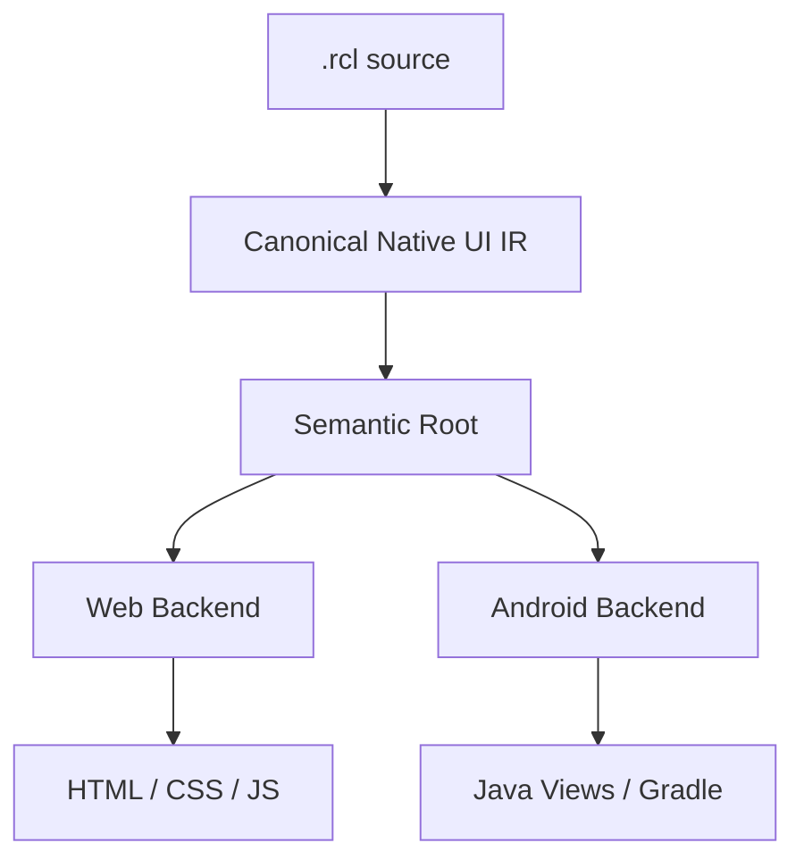
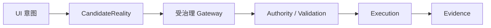
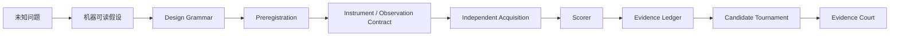

<div align="center">

# RCL — Reality Compiler Language

**一门用于表达、验证并向真实软件环境降级受治理状态变化的自举编程语言与现实编译器。**

[English](README.md) · [简体中文](README.zh-CN.md) · [网站 / Playground](https://rcl-rncs-mcp.vercel.app) · [当前状态](CURRENT-STATUS.md)

[](LICENSE)
[](package.json)
[](CURRENT-STATUS.md)
[](CURRENT-STATUS.md)

</div>

> RCL 是一套带证据、受权限约束的编程语言、编译器、Native VM、Provider Runtime 与验证工具链。

RCL 的核心思路是：**把状态变化本身变成一等对象，而不是只把“调用函数”当成程序的中心。**

```text
意图
→ 显式状态与权威
→ 候选变化
→ 约束 / 不变量验证
→ Lowering 或执行
→ 证据
→ 受治理结果
```



当前 RCL 已拥有 Native-Core 自举编译器路径、Native VM、Web / Android lowering、平台中立的 Native UI 语义模型，以及长期维护的 Universal Program Stress 验证矩阵。

RCL **当前不宣称已经成为通用/万能编程语言**。仓库的目标，是用可反证、可重复、非补偿式证据逐步测试它的真实能力上限。

---

## 为什么是 RCL？

传统程序通常从“执行操作”开始：调用函数、修改变量、发送请求。

RCL 则显式要求回答：

- **谁**在行动？
- **什么权限**允许这次行动？
- **什么状态**允许改变？
- **哪些不变量**必须保持？
- **什么证据**证明这次变化发生过？
- 验证失败后，系统应该**拒绝、保留还是回滚**？

### 最小示例

```rcl
reality Counter {
  facet app.count : Number = 0

  subject user {
    warrant app.write on app
  }

  emergence increment {
    cause user
    needs app.write on app
    alter app.count <- app.count + 1
    preserve app.count >= 0
    witness "counter:increment"
  }
}
```

这段程序不仅表示“把数字加一”，还声明了主体、授权、候选状态变化、不变量和证据。

---

## 程序员建议从这些示例开始

如果你第一次打开这个仓库，**不建议从目录和架构文档一路往下啃**。按下面顺序看，十几分钟内会更容易理解 RCL 到底在做什么：

| 示例 | 主要展示 | 源文件 |
|---|---|---|
| 受治理状态变化 | state、authority、guard、mutation、invariant、evidence | [`examples/universal-stress/k02-complete-web-app.rcl`](examples/universal-stress/k02-complete-web-app.rcl) |
| Native UI 计数器 | state、derived、binding、layout、style、event | [`examples/native-ui/counter.rcl`](examples/native-ui/counter.rcl) |
| 应用内导航 | route 与原子化 UI-local navigation | [`examples/native-ui/navigation.rcl`](examples/native-ui/navigation.rcl) |
| 设备自适应 | width profile 与跨平台自适应布局意图 | [`examples/native-ui/device-adaptation.rcl`](examples/native-ui/device-adaptation.rcl) |
| Android 垂直切片 | 受治理应用状态如何 Lower 到 Android 路径 | [`examples/universal-stress/k03-native-android-app.rcl`](examples/universal-stress/k03-native-android-app.rcl) |

### 示例 1：一个更像真实程序的状态变化

K02 Web 示例虽然很小，但已经能把 RCL 的核心结构看清楚：

```rcl
reality K02CompleteWebApp {
  facet app.todo_count : Number = 0
  facet app.todo_input : Text = ""
  facet app.last_action : Text = "boot"

  subject user {
    warrant app.write on app
  }

  emergence addTodo {
    cause user
    when app.todo_input != ""
    needs app.write on app
    alter app.todo_count <- app.todo_count + 1
    alter app.last_action <- app.todo_input
    alter app.todo_input <- ""
    preserve app.todo_count >= 0
    witness "rcl:k02:add-todo"
  }
}
```

可以直接把它理解成：

```text
状态
+ 谁在操作
+ 他有什么权限
+ 什么条件下能操作
+ 候选状态怎么改
+ 哪些条件必须始终成立
+ 用什么证据记录这次变化
```

这就是很多更大 RCL 程序不断复用的母结构。

### 示例 2：UI 不只是外挂壳，而是语义的一部分

Native UI Counter 直接在 RCL 里维护状态、派生值、绑定和交互：

```rcl
reality NativeUICounter {
  ui CounterApp {
    state count : Number = 0
    derived count_label : Text = "计数：" + count

    view Root {
      layout vertical {
        width fill
        height intrinsic
        gap 12
        padding 24
        align stretch
        distribute start
      }

      text CounterText {
        bind value <- count_label
      }

      action IncrementButton {
        label "增加"
        on activate {
          set count <- count + 1
        }
      }
    }
  }
}
```

完整文件里还有 lifecycle、theme、style、accessibility label 和 reset 行为。当前候选实现会让同一份 rooted UI semantics Lower 到 Web 和 Android 后端。

### 示例 3：导航也是 RCL 语义

```rcl
navigation {
  initial home
  route home -> HomeScreen
  route settings -> SettingsScreen
}

on activate {
  set visits <- visits + 1
  navigate settings
}
```

完整文件：[`examples/native-ui/navigation.rcl`](examples/native-ui/navigation.rcl)。

### 示例 4：同一个 UI 意图，根据设备宽度改变布局

```rcl
adaptation {
  default compact
  profile compact min_width 0 max_width 599
  profile expanded min_width 600
}

view Root {
  layout vertical {
    width fill
    height intrinsic
  }

  adapt expanded layout horizontal
}
```

当前候选实现会把这份语义分别 Lower 成 Web width-profile 行为，以及 Android 基于 `screenWidthDp` 的布局选择。

### 推荐阅读顺序

```text
最小 Counter
→ K02 Web 状态变化
→ Native UI Counter
→ Navigation
→ Device Adaptation
→ K03 Android 垂直切片
→ selfhost/compiler-core.rcl
```

更多可运行示例和 Evidence Fixtures 都在 [`examples/`](examples/) 目录。

---

## 当前已经验证到什么程度？

当前 package 基线仍为 **`v0.94.0-alpha.1`**。最准确的实时证据边界请查看 [`CURRENT-STATUS.md`](CURRENT-STATUS.md)。

| 能力 | 当前状态 |
|---|---|
| RCL 编写的通用编译器 | **已验证** |
| Native-Core 编译器固定点 `C0 == C1 == C2` | **已验证** |
| Native VM / Compiler Path | **存在并已测试** |
| 整门语言 Runtime 全自举 | **不宣称** |
| 完整 Web 垂直切片 | **9 个门中已有 8 个证据；AI_GENERATE 未闭合** |
| Android 工程 / APK 构建路径 | **已验证** |
| Android 真机安装与交互 | **当前记录中仍未验证** |
| Web / Android 共用 Native UI semantic root | **当前候选切片已验证** |
| Native UI Navigation + 宽度自适应 | **候选状态，自举切片已验证** |
| Universal Program Stress | **持续运行，大部分 400 格仍保持 UNKNOWN** |

---

## 自举编译器

RCL 包含一个用 RCL 自身编写的编译器，以及 Native Compiler / VM 路径。

```text
RCL 编译器源码
      ↓
     C0
      ↓
用编译器编译自己
      ↓
     C1
      ↓
再次编译
      ↓
     C2

C0 == C1 == C2
```

这里必须区分：

- **Native-Core Self-Hosting：已验证**
- **Whole-Language Runtime Self-Hosting：未宣称**

---

## Native UI Genome

RCL 正在把 UI 作为语言语义的一部分，而不是把 Web 和 Android 当成两个完全独立的前端。

当前候选语义已经包括：

- state / derived expressions；
- lifecycle / restore；
- theme / style rules；
- recursive view tree；
- bindings；
- typed / inferred event parameters；
- governed `reality-transaction`；
- fixed sizing；
- in-app navigation；
- available-width adaptation profiles。



真实 Chrome 已验证当前 width-profile adaptation；Android backend 也已经从同一 semantic root 生成并构建真实 Debug APK。

但要注意：**Android 真机安装、配置变化、真实交互与性能目前仍未在正式 campaign 中闭合。**

---

## UI 与现实治理

RCL 明确区分：

```text
UI-local event
→ local candidate state
→ local validation
→ local commit
```

和：



UI 本身不能直接提交外部现实变化。未知规则、混合 authority handler 等情况在已验证切片中会 fail closed。

---

## Universal Program Stress

RCL 当前的长期验证主线是一张固定的：

```text
20 个环境族 × 20 个程序族 = 400 个长期验证格
```

每个证据格需要独立通过 9 个非补偿式 Gate：

1. `EXPRESS`
2. `COMPILE`
3. `LOWER`
4. `EXECUTE`
5. `CORRECT`
6. `ROBUST`
7. `PERFORMANCE`
8. `AI_GENERATE`
9. `EVIDENCE`

缺一个必要 Gate 就是 BLOCKED；某个必要 Gate 失败就是 FAIL，不能用其它高分抵消。

### 当前 Killer Tasks

| Task | 目标 | 模式 | 当前结果 |
|---|---|---|---|
| **K01** | 自举编译器 | native semantic | `BLOCKED (8/9)` |
| **K02** | 完整 Web 应用 | lowered execution | `BLOCKED (8/9)` |
| **K03** | Native Android 应用 | lowered execution | `BLOCKED` |
| **K04** | 2D Game | 下一轮 campaign | 尚未宣称 |

---

## 三种能力模式

RCL 明确区分：

### `native-semantic`

RCL 自己拥有相关计算语义。

### `lowered-execution`

RCL 拥有语义，但有意把执行 Lower 到浏览器、Android、SQL、GPU 或其它 backend organ。

### `opaque-delegation`

RCL 把真正困难的问题整体交给外部工具或其它语言，然后只接收结果。

Opaque delegation 可以很有用，但**不能冒充 RCL 原生能力**。

---

## Frontier：把未知问题编译成实验

RCL 还有一条实验性的 Frontier Research 线，目标不是“宣布发现未知规律”，而是把未知问题编译成可反证实验。



当前 Frontier 沙箱成功只能证明协议能否区分预构造世界，**不能推出新物理、外部未知信息通道或其它现实结论。**

---

## 快速开始

### 环境

- Node.js 22+
- Native 构建需要受支持的 C/C++ toolchain
- Android 目标需要 Android 构建环境

### 安装和测试

```bash
npm install
npm test
```

### 运行一个示例

```bash
node src/cli.mjs run examples/hello-reality.rcl
```

### 构建并验证 Native Toolchain

```bash
npm run build:native
npm run build:selfhost-compiler
npm run verify:selfhost-fixedpoint
npm run verify:selfhost-examples
```

### 运行 Universal Program Stress

```bash
node --test tests/universal-program-stress.test.mjs
node scripts/universal-program-stress-report.mjs
node scripts/run-universal-stress-k01.mjs
```

---

## 项目目录

```text
src/                         语言 / Runtime / Reference Implementation
selfhost/                    RCL 编写的编译器源码与 fixed-point artifact
native/                      Native VM / Compiler / Provider Boundary
examples/                    可运行示例与 Evidence Fixtures
tests/                       Conformance / Regression / Stress Tests
scripts/                     Build / Verification / Stress Runner
docs/                        架构、Campaign、Evidence、Governance
CURRENT-STATUS.md            当前人类可读权威状态
VERSION-CONTRACT.json        机器可读 Capability Contract
COMPONENT-VERSIONS.json      受治理 Component Identity
```

---

## 开发原则

RCL 不是靠不断添加功能来“看起来更通用”，而是沿着：

```text
Stress
→ Failure
→ Missing Primitive / Unabsorbed Advantage
→ Candidate Design
→ Semantic + Execution Tests
→ Regression
→ Evidence
→ Selection
→ Inheritance
→ Full Matrix Rerun
```

失败实验本身也是结果，因为它暴露了语言真正尚未拥有的能力。

---

## 欢迎贡献

适合外部贡献的方向包括：

- 当前语义的最小可复现失败案例；
- Universal Program Stress 暴露出的 missing primitive；
- 保持 RCL-owned semantics 的 backend lowering；
- Reference / Self-host / Native 路径差分测试；
- Self-host Compiler / VM 性能优化；
- Native UI resources、accessibility、真机验证；
- Evidence boundary 文档；
- K01 / K02 独立 AI generation / repair evaluation。

**更强的 claim 必须来自更强的 evidence，而不是更强的措辞。**

---

## 当前不宣称

本仓库当前**不宣称**：

- RCL 已经能写所有程序；
- Whole-language runtime 已完全自举；
- 所有 Foundation domain 都是 native；
- Android 真机执行已经完成正式验证；
- 生成 artifact 等于真实运行成功；
- Frontier 沙箱实验已经证明新的自然规律或现实外部效应。

项目的意义恰恰是：把这些边界变成显式、可测试、可反证的工程对象。

---

## License

Apache-2.0。详见 [`LICENSE`](LICENSE)。