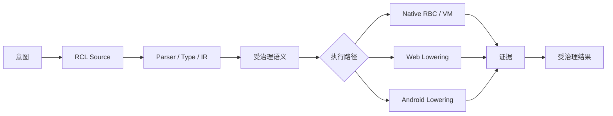
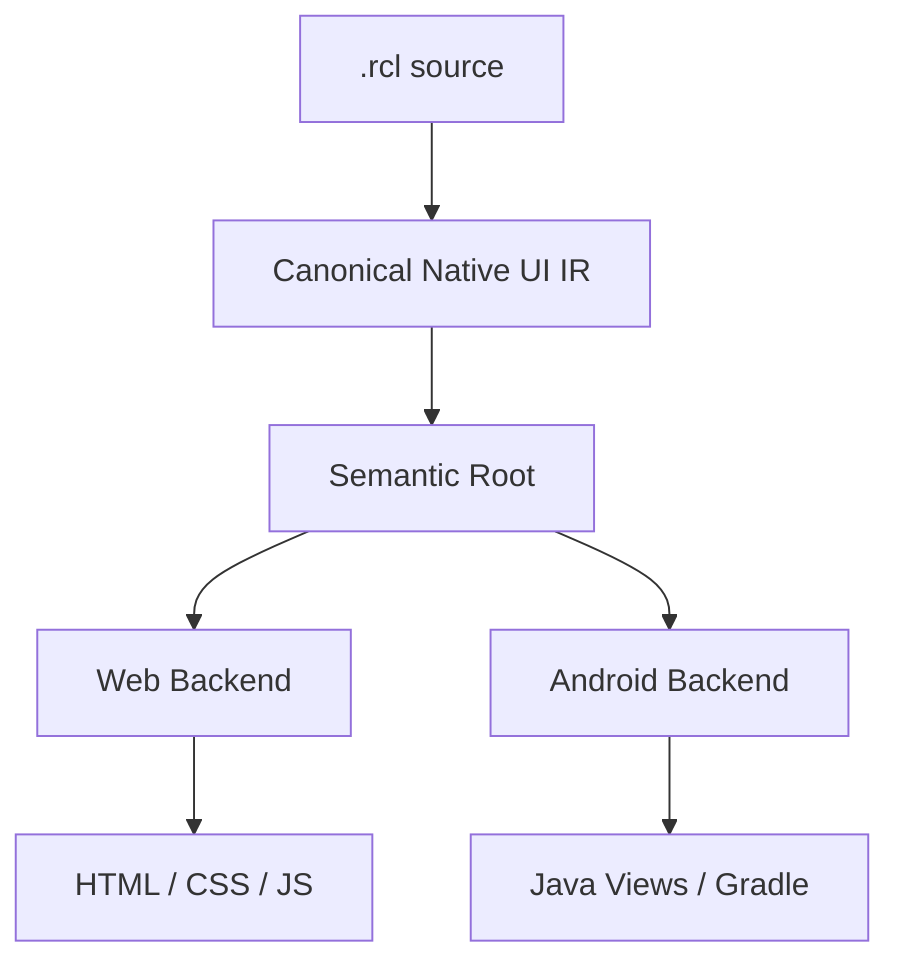
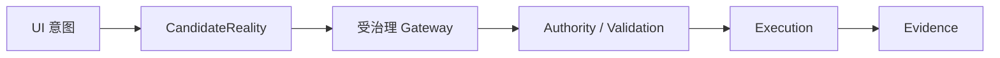
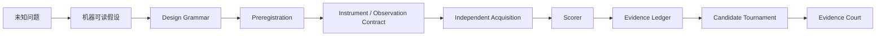
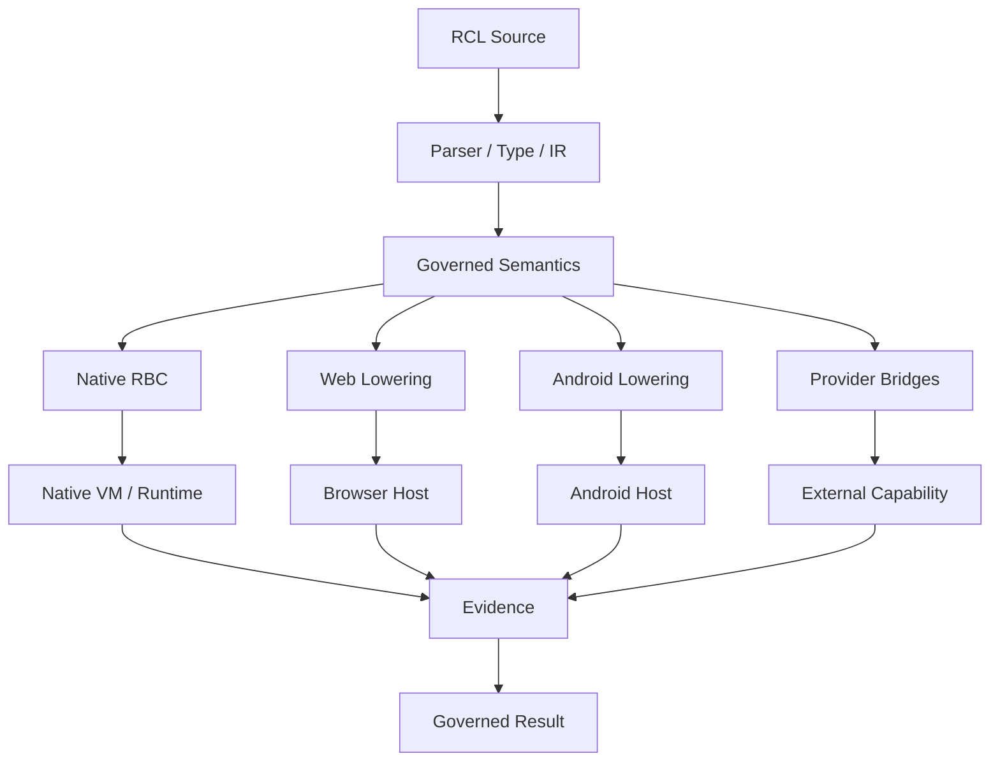

<div align="center">

# RCL v0.94.0-alpha.1 — Reality Compiler Language

**一门用于表达、验证并向真实软件环境 Lower 受治理状态变化的自举编程语言与现实编译器。**

[English](README.md) · [简体中文](README.zh-CN.md) · [5 分钟上手](GETTING_STARTED.zh-CN.md) · [网站 / Playground](https://rcl-rncs-mcp.vercel.app) · [当前状态](CURRENT-STATUS.md)

[](LICENSE)
[](package.json)
[](CURRENT-STATUS.md)
[](CURRENT-STATUS.md)

</div>

Canonical source：`xingxuling/RCL@main`

> RCL 是一套带证据、受权限约束的编程语言、编译器、Native VM、Provider Runtime 与验证工具链。

RCL 的核心不是“多几个关键字”，而是把一次状态变化完整写成：

```text
意图
→ 显式状态与权威
→ 候选变化
→ 约束 / 不变量验证
→ Lowering 或执行
→ 证据
→ 受治理结果
```



当前 RCL 已拥有 Native-Core 自举编译器路径、Native VM、Web / Android Lowering、平台中立 Native UI 语义模型，以及长期维护的 Universal Program Stress 验证矩阵。

[TaoWind 辅助语言联邦 v0.1](docs/language-federation/federation-architecture.md) 是候选共享契约与注册层：RCL 继续拥有唯一 Canonical Reality IR，同时以有界 ASIL Profile 联邦 RSL、IAL、SNLL 与 CSL 等独立语言器官，且翻译本身不授予执行权。

RCL **当前不宣称已经成为万能/通用编程语言**。仓库的目标，是把“能不能做到”变成可测试、可反证、可重复的工程问题。

---

# 如果你是程序员，先从这里开始

第一次打开仓库觉得抽象，不要先啃架构文档。先跑。

## 1. 克隆并安装

```bash
git clone https://github.com/xingxuling/RCL.git
cd RCL
npm install
```

JavaScript / Reference Toolchain 需要 Node.js 22+。

## 2. 跑最小的真实程序

```bash
npm run demo
```

这个命令运行 [`examples/hello-reality.rcl`](examples/hello-reality.rcl)：

```rcl
reality FirstLight {
  facet world.greeting : Text = "unformed"

  subject founder {
    facet awareness : Number = 0
    warrant world.write on world
  }

  emergence hello {
    cause founder
    when world.greeting == "unformed"
    needs world.write on world
    alter world.greeting <- "Hello, reality."
    alter founder.awareness <- founder.awareness + 1
    preserve founder.awareness >= 0
    witness "rcl:first-light"
  }

  foresee hello
  realize hello
}
```

先把它理解成：

```text
初始状态
+ 谁在操作
+ 他有什么权限
+ 什么条件下能操作
+ 候选状态怎么改变
+ 哪些条件必须始终保持
+ 用什么 witness / evidence 记录
+ commit
```

重点不是那句 Hello，而是：**谁能改什么、什么时候能改、改完必须保证什么，都写进程序里。**

## 3. 跑 Native Path

```bash
npm run build:native
npm run demo:native
```

再看 Bytecode → Native Execution：

```bash
npm run demo:bytecode
```

## 4. 完整 5 分钟路线

Web 状态、Native UI、Android、Bytecode、自举编译器验证都放在：

**→ [`GETTING_STARTED.zh-CN.md`](GETTING_STARTED.zh-CN.md)**

英文版：

**→ [`GETTING_STARTED.md`](GETTING_STARTED.md)**

---

## 为什么是 RCL？

传统程序通常从操作开始：调用函数、改变量、发请求。

RCL 则显式要求回答：

- **谁**在行动？
- **什么权限**允许这次行动？
- **什么状态**允许改变？
- **哪些不变量**必须保持？
- **什么证据**证明这次变化发生过？
- 验证失败后应该拒绝、保留还是回滚？

最小结构：

```rcl
reality Counter {
  facet app.count : Number = 0

  subject user {
    warrant app.write on app
  }

  emergence increment {
    cause user
    needs app.write on app
    alter app.count <- app.count + 1
    preserve app.count >= 0
    witness "counter:increment"
  }
}
```

这段程序不仅表示“数字加一”，还声明了主体、授权、候选状态变化、不变量和证据。

---

## 程序员建议按这些示例看

| 示例 | 主要展示 | 源文件 |
|---|---|---|
| First Light | 最小状态 + 权威 + 状态变化 | [`examples/hello-reality.rcl`](examples/hello-reality.rcl) |
| 受治理 Web 状态 | guard、mutation、invariant、evidence | [`examples/universal-stress/k02-complete-web-app.rcl`](examples/universal-stress/k02-complete-web-app.rcl) |
| Native UI 计数器 | state、derived、binding、layout、style、event | [`examples/native-ui/counter.rcl`](examples/native-ui/counter.rcl) |
| 应用内导航 | route 与原子化 UI-local navigation | [`examples/native-ui/navigation.rcl`](examples/native-ui/navigation.rcl) |
| 设备自适应 | width profile 与跨平台自适应布局意图 | [`examples/native-ui/device-adaptation.rcl`](examples/native-ui/device-adaptation.rcl) |
| Android 垂直切片 | 受治理应用状态如何 Lower 到 Android | [`examples/universal-stress/k03-native-android-app.rcl`](examples/universal-stress/k03-native-android-app.rcl) |

### Native UI 示例

```rcl
reality NativeUICounter {
  ui CounterApp {
    state count : Number = 0
    derived count_label : Text = "计数：" + count

    view Root {
      layout vertical {
        width fill
        height intrinsic
        gap 12
        padding 24
        align stretch
        distribute start
      }

      text CounterText {
        bind value <- count_label
      }

      action IncrementButton {
        label "增加"
        on activate {
          set count <- count + 1
        }
      }
    }
  }
}
```

完整文件还有 lifecycle、theme、style、accessibility label 和 reset 行为。

### Navigation 示例

```rcl
navigation {
  initial home
  route home -> HomeScreen
  route settings -> SettingsScreen
}

on activate {
  set visits <- visits + 1
  navigate settings
}
```

### Device Adaptation 示例

```rcl
adaptation {
  default compact
  profile compact min_width 0 max_width 599
  profile expanded min_width 600
}

view Root {
  layout vertical {
    width fill
    height intrinsic
  }

  adapt expanded layout horizontal
}
```

当前候选实现会把同一份语义 Lower 成 Web width-profile 行为，以及 Android 基于 `screenWidthDp` 的布局选择。

推荐阅读顺序：

```text
hello-reality.rcl
→ K02 Web 状态变化
→ Native UI Counter
→ Navigation
→ Device Adaptation
→ K03 Android 垂直切片
→ selfhost/compiler-core.rcl
→ CURRENT-STATUS.md
```

更多可运行示例与 Evidence Fixtures 都在 [`examples/`](examples/) 目录。

---

## 当前已经验证到什么程度？

当前 package 基线仍为 **`v0.94.0-alpha.1`**。最准确的实时证据边界请查看 [`CURRENT-STATUS.md`](CURRENT-STATUS.md)。

| 能力 | 当前状态 |
|---|---|
| RCL 编写的通用编译器 | **已验证** |
| Native-Core 编译器固定点 `C0 == C1 == C2` | **已验证** |
| Native VM / Compiler Path | **存在并已测试** |
| 整门语言 Runtime 全自举 | **不宣称** |
| 完整 Web 垂直切片 | **9 个门中已有 8 个证据；AI_GENERATE 未闭合** |
| Android 工程 / APK 构建路径 | **已验证** |
| Android 真机安装与交互 | **当前记录中仍未验证** |
| Web / Android 共用 Native UI semantic root | **当前候选切片已验证** |
| Native UI Navigation + 宽度自适应 | **候选状态，自举切片已验证** |
| Universal Program Stress | **持续运行，大部分 400 格仍保持 UNKNOWN** |

### 自举编译器

```text
RCL 编译器源码
      ↓
     C0
      ↓
用编译器编译自己
      ↓
     C1
      ↓
再次编译
      ↓
     C2

C0 == C1 == C2
```

必须区分：

- **Native-Core Self-Hosting：已验证**
- **Whole-Language Runtime Self-Hosting：未宣称**

---

## Native UI Genome

RCL 正在把 UI 作为语言语义的一部分，而不是把 Web 和 Android 当成两个毫无关系的前端。

当前候选语义包括：

- state / derived expressions；
- lifecycle / restore；
- theme / style rules；
- recursive view tree；
- bindings；
- typed / inferred event parameters；
- governed `reality-transaction`；
- fixed sizing；
- in-app navigation；
- available-width adaptation profiles。



真实 Chrome 已验证当前 width-profile adaptation；Android Backend 也已经从同一 semantic root 生成并构建真实 Debug APK。

但：**Android 真机安装、配置变化、真实交互与性能目前仍未在正式 campaign 中闭合。**

---

## UI 与现实治理

RCL 明确区分本地 UI 状态变化：

```text
UI-local event
→ local candidate state
→ local validation
→ local commit
```

和现实动作：



UI 本身不能直接提交外部现实变化。未知规则、混合 authority handler 等情况在已验证切片中会 fail closed。

---

## Universal Program Stress

RCL 当前长期验证主线是一张固定的：

```text
20 个环境族 × 20 个程序族 = 400 个长期验证格
```

每个证据格需要独立通过 9 个非补偿式 Gate：

1. `EXPRESS`
2. `COMPILE`
3. `LOWER`
4. `EXECUTE`
5. `CORRECT`
6. `ROBUST`
7. `PERFORMANCE`
8. `AI_GENERATE`
9. `EVIDENCE`

缺一个必要 Gate 就是 BLOCKED；必要 Gate 失败就是 FAIL，不能靠其它高分抵消。

### 当前 Killer Tasks

| Task | 目标 | 模式 | 当前结果 |
|---|---|---|---|
| **K01** | 自举编译器 | native semantic | `BLOCKED (8/9)` |
| **K02** | 完整 Web 应用 | lowered execution | `BLOCKED (8/9)` |
| **K03** | Native Android 应用 | lowered execution | `BLOCKED` |
| **K04** | 2D Game | 下一轮 campaign | 尚未宣称 |

---

## 三种能力模式

### `native-semantic`

RCL 自己拥有相关计算语义。

### `lowered-execution`

RCL 拥有语义，但有意把执行 Lower 到浏览器、Android、SQL、GPU 或其它 Backend Organ。

### `opaque-delegation`

RCL 把真正困难的问题整体交给外部工具或其它语言，然后只接收结果。

Opaque delegation 可以很有用，但**不能冒充 RCL 原生能力**。

---

## Frontier：把未知问题编译成实验



当前 Frontier 沙箱成功只能证明协议能否区分预构造世界，**不能推出新物理、外部未知信息通道或其它现实结论。**

---

## 架构



---

## 常用命令

```bash
npm install
npm run demo
npm run build:native
npm run demo:native
npm run demo:bytecode
npm run build:selfhost-compiler
npm run verify:selfhost-fixedpoint
npm run verify:selfhost-examples
```

逐步解释见 [`GETTING_STARTED.zh-CN.md`](GETTING_STARTED.zh-CN.md)。

---

## 项目目录

```text
src/                         语言 / Runtime / Reference Implementation
selfhost/                    RCL 编写的编译器源码与 fixed-point artifact
native/                      Native VM / Compiler / Provider Boundary
examples/                    可运行示例与 Evidence Fixtures
tests/                       Conformance / Regression / Stress Tests
scripts/                     Build / Verification / Stress Runner
docs/                        架构、Campaign、Evidence、Governance
CURRENT-STATUS.md            当前人类可读权威状态
VERSION-CONTRACT.json        机器可读 Capability Contract
COMPONENT-VERSIONS.json      受治理 Component Identity
```

---

## 欢迎贡献

适合外部贡献的方向包括：

- 当前语义的最小可复现失败案例；
- Universal Program Stress 暴露出的 missing primitive；
- 保持 RCL-owned semantics 的 Backend Lowering；
- Reference / Self-host / Native 路径差分测试；
- Self-host Compiler / VM 性能优化；
- Native UI resources、accessibility、真机验证；
- K01 / K02 独立 AI generation / repair evaluation。

**更强的 claim 必须来自更强的 evidence，而不是更强的措辞。**

---

## 当前不宣称

本仓库当前**不宣称**：

- RCL 已经能写所有程序；
- Whole-Language Runtime 已完全自举；
- 所有 Foundation Domain 都是 Native；
- Android 真机执行已经完成正式验证；
- 生成 Artifact 等于真实运行成功；
- Frontier 沙箱实验已经证明新的自然规律或现实外部效应。

项目的意义恰恰是：把这些边界变成显式、可测试、可反证的工程对象。

---

## License

Apache-2.0。详见 [`LICENSE`](LICENSE)。
