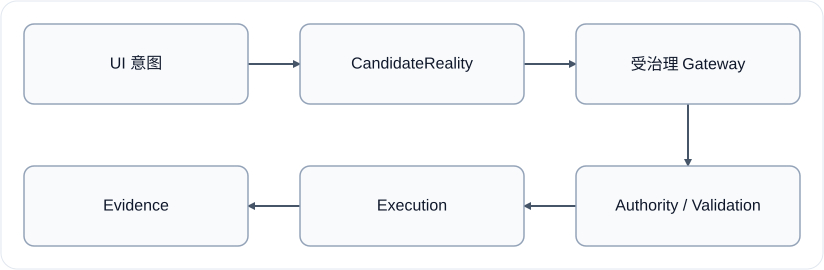
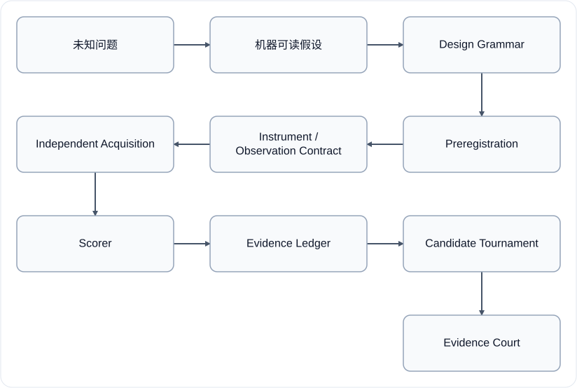

<div align="center">

# RCL v1.0.0 — Reality Compiler Language

**把权限、状态变化和执行证据写进程序的编程语言。**

[English](README.md) · [简体中文](README.zh-CN.md) · [5 分钟上手](GETTING_STARTED.zh-CN.md) · [网站 / Playground](https://rcl-rncs-mcp.vercel.app) · [当前状态](CURRENT-STATUS.md)

[](LICENSE)
[](package.json)
[](CURRENT-STATUS.md)
[](CURRENT-STATUS.md)

</div>

RCL（Reality Compiler Language）是一门开源编程语言，面向需要明确约束状态变化的程序：**谁可以行动、允许改变什么、哪些条件必须成立，以及如何记录执行结果的证据**。

本仓库包含语言实现、用 RCL 编写的 Native-Core 编译器、原生字节码虚拟机、Web / Android 后端与验证工具链。正式源码：`xingxuling/RCL@main`。

## 为什么使用 RCL？

- **把权限和行为写在一起。** 主体、授权凭证、前置条件、状态修改与不变量都是语言构造。状态变化直接声明自身的权限和验证要求，不必只靠外围应用代码隐式约定。
- **让执行结果可检查。** 状态变化产生 witness 与 evidence；工具链用工件根和语义状态根核对不同实现的结果。证据始终绑定实际验证过的范围。
- **跨执行目标保留语义。** RCL 拥有状态与权限模型，原生字节码、Web 和 Android 路径提供不同的执行环境。候选 Native UI 模型在 Web / Android 后端之间共享 IR 与语义根。
- **用编译器验证编译器。** Native-Core 编译器用 RCL 编写，已有字节完全一致的 `C0 == C1 == C2` 固定点记录。这是编译器自举，不代表整套运行时已经完全自举。

RCL 适合探索带权限约束的应用状态、可审计自动化与语言 / 运行时研究。v1.0 稳定核心语言、原生状态根协议、公共 CLI 和可安装源码工具链；研究扩展仍按各自证据与成熟度分类。

[快速开始](#快速开始) · [示例](#程序员建议按这些示例看) · [当前成熟度](#当前已经验证到什么程度) · [架构](#架构) · [参与贡献](#欢迎贡献)

---

## v1.0

原生 VM 与 `rcl run` 默认使用 `rcl.semantic-state-root.v2`，以精确有限 binary64 编码绑定最终状态与转移前后根。历史原生 v1 凭据仍可显式选择算法验证。`runReality` Reference API 保留其独立的 `rcl.reference-state-root.v0.6` 默认；使用 `stateRootAlgorithm` 可选择跨运行时 v2。参见[稳定契约](docs/v1.0/language-contract.md)、[状态根协议](docs/v1.0/semantic-state-root-v2.md)与[发布验收](docs/v1.0/acceptance.md)。

## 快速开始

依赖：Git、Node.js 20+ 与 npm。先从源码运行 JavaScript / Reference Runtime：

### 1. 克隆并安装

```bash
git clone https://github.com/xingxuling/RCL.git
cd RCL
npm install
```

### 2. 运行一个完整程序

```bash
npm run demo
```

这个命令运行 [`examples/hello-reality.rcl`](examples/hello-reality.rcl)：

```rcl
reality FirstLight {
  facet world.greeting : Text = "unformed"

  subject founder {
    facet awareness : Number = 0
    warrant world.write on world
  }

  emergence hello {
    cause founder
    when world.greeting == "unformed"
    needs world.write on world
    alter world.greeting <- "Hello, reality."
    alter founder.awareness <- founder.awareness + 1
    preserve founder.awareness >= 0
    witness "rcl:first-light"
  }

  foresee hello
  realize hello
}
```

先把它理解成：

```text
初始状态
+ 谁在操作
+ 他有什么权限
+ 什么条件下能操作
+ 候选状态怎么改变
+ 哪些条件必须始终保持
+ 用什么 witness / evidence 记录
+ commit
```

重点不是那句 Hello，而是：**谁能改什么、什么时候能改、改完必须保证什么，都写进程序里。**

### 3. 构建并运行 Native Path

Unix 类系统的原生构建需要 `make`、C11 编译器与 OpenSSL / libcrypto 开发文件，见 [`native/Makefile`](native/Makefile)。Windows 使用独立的 [`build-native-windows.mjs`](scripts/build-native-windows.mjs) 工具链路径。原生构建依赖与上面的参考运行时快速开始是分开的。

```bash
npm run build:native
npm run demo:native
```

再看 Bytecode → Native Execution：

```bash
npm run demo:bytecode
```

### 4. 继续学习

Web 状态、Native UI、Android、Bytecode、自举编译器验证都放在：

**→ [`GETTING_STARTED.zh-CN.md`](GETTING_STARTED.zh-CN.md)**

英文版：

**→ [`GETTING_STARTED.md`](GETTING_STARTED.md)**

---

## 当前已经验证到什么程度？

正式 `main` 已通过 [PR #262](https://github.com/xingxuling/RCL/pull/262) 晋级至 **`v1.0.0`**。[本地发布验证记录](docs/v1.0/verification.json)包含 1683 项通过、0 项失败、2 项跳过、Windows/Linux 独立安装检查和 41 个自举验证阶段。远端部署与 npm 发布分别记录；各项能力的证据与成熟度边界见 [`CURRENT-STATUS.md`](CURRENT-STATUS.md)。

| 能力 | 当前状态 |
|---|---|
| RCL 编写的通用编译器 | **已验证** |
| Native-Core 编译器固定点 `C0 == C1 == C2` | **已验证** |
| Native VM / Compiler Path | **存在并已测试** |
| 整门语言 Runtime 全自举 | **不宣称** |
| 完整 Web 垂直切片 | **有界 K02 profile 已通过 9/9 个 Gate** |
| Android 工程 / APK 构建路径 | **已验证** |
| Android 安装与交互 | **有界 K03 API 35 模拟器 profile 已通过；不宣称物理真机验证** |
| Web / Android 共用 Native UI semantic root | **当前候选切片已验证** |
| Native UI Navigation + 宽度自适应 | **候选状态，自举切片已验证** |
| Universal Program Stress | **持续运行，大部分 400 格仍保持 UNKNOWN** |

### 自举编译器

```text
RCL 编译器源码
      ↓
     C0
      ↓
用编译器编译自己
      ↓
     C1
      ↓
再次编译
      ↓
     C2

C0 == C1 == C2
```

必须区分：

- **Native-Core Self-Hosting：已验证**
- **Whole-Language Runtime Self-Hosting：未宣称**

---

## 程序员建议按这些示例看

| 示例 | 主要展示 | 源文件 |
|---|---|---|
| First Light | 最小状态 + 权威 + 状态变化 | [`examples/hello-reality.rcl`](examples/hello-reality.rcl) |
| 受治理 Web 状态 | guard、mutation、invariant、evidence | [`examples/universal-stress/k02-complete-web-app.rcl`](examples/universal-stress/k02-complete-web-app.rcl) |
| Native UI 计数器 | state、derived、binding、layout、style、event | [`examples/native-ui/counter.rcl`](examples/native-ui/counter.rcl) |
| 应用内导航 | route 与原子化 UI-local navigation | [`examples/native-ui/navigation.rcl`](examples/native-ui/navigation.rcl) |
| 设备自适应 | width profile 与跨平台自适应布局意图 | [`examples/native-ui/device-adaptation.rcl`](examples/native-ui/device-adaptation.rcl) |
| Android 垂直切片 | 受治理应用状态如何 Lower 到 Android | [`examples/universal-stress/k03-native-android-app.rcl`](examples/universal-stress/k03-native-android-app.rcl) |

### Native UI 示例

```rcl
reality NativeUICounter {
  ui CounterApp {
    state count : Number = 0
    derived count_label : Text = "计数：" + count

    view Root {
      layout vertical {
        width fill
        height intrinsic
        gap 12
        padding 24
        align stretch
        distribute start
      }

      text CounterText {
        bind value <- count_label
      }

      action IncrementButton {
        label "增加"
        on activate {
          set count <- count + 1
        }
      }
    }
  }
}
```

完整文件还有 lifecycle、theme、style、accessibility label 和 reset 行为。

### Navigation 示例

```rcl
navigation {
  initial home
  route home -> HomeScreen
  route settings -> SettingsScreen
}

on activate {
  set visits <- visits + 1
  navigate settings
}
```

### Device Adaptation 示例

```rcl
adaptation {
  default compact
  profile compact min_width 0 max_width 599
  profile expanded min_width 600
}

view Root {
  layout vertical {
    width fill
    height intrinsic
  }

  adapt expanded layout horizontal
}
```

当前候选实现会把同一份语义 Lower 成 Web width-profile 行为，以及 Android 基于 `screenWidthDp` 的布局选择。

推荐阅读顺序：

```text
hello-reality.rcl
→ K02 Web 状态变化
→ Native UI Counter
→ Navigation
→ Device Adaptation
→ K03 Android 垂直切片
→ selfhost/compiler-core.rcl
→ CURRENT-STATUS.md
```

更多可运行示例与 Evidence Fixtures 都在 [`examples/`](examples/) 目录。

---

## Native UI Genome

RCL 正在把 UI 作为语言语义的一部分，而不是把 Web 和 Android 当成两个毫无关系的前端。

当前候选语义包括：

- state / derived expressions；
- lifecycle / restore；
- theme / style rules；
- recursive view tree；
- bindings；
- typed / inferred event parameters；
- governed `reality-transaction`；
- fixed sizing；
- in-app navigation；
- available-width adaptation profiles。


[可编辑图表源码](docs/readme-diagrams/native-ui-genome.mmd)。

真实 Chrome 已验证当前 width-profile adaptation；Android Backend 也已经从同一 semantic root 生成并构建真实 Debug APK。

有界 K03 transaction UI 已记录 API 35 模拟器安装、交互、旋转恢复与性能证据。**这不等于物理真机验证，也不覆盖全部 Native UI 候选功能。** 具体边界见 [`CURRENT-STATUS.md`](CURRENT-STATUS.md)。

---

## UI 与现实治理

RCL 明确区分本地 UI 状态变化：

```text
UI-local event
→ local candidate state
→ local validation
→ local commit
```

和现实动作：



[可编辑图表源码](docs/readme-diagrams/governed-ui-zh.mmd)。

UI 本身不能直接提交外部现实变化。未知规则、混合 authority handler 等情况在已验证切片中会 fail closed。

---

## Universal Program Stress

RCL 当前长期验证主线是一张固定的：

```text
20 个环境族 × 20 个程序族 = 400 个长期验证格
```

每个证据格需要独立通过 9 个非补偿式 Gate：

1. `EXPRESS`
2. `COMPILE`
3. `LOWER`
4. `EXECUTE`
5. `CORRECT`
6. `ROBUST`
7. `PERFORMANCE`
8. `AI_GENERATE`
9. `EVIDENCE`

缺一个必要 Gate 就是 BLOCKED；必要 Gate 失败就是 FAIL，不能靠其它高分抵消。

当前记录为 `24 PASS / 0 BLOCKED / 376 UNTESTED`，成熟度 `U3`，K400 仍为 `INCOMPLETE`。PASS 仅针对冻结的有界证据 profile，不代表整个程序族或环境族均已解决。K233 的有界两层 Dense General MLP profile 已闭合；后续 Tensor / Autodiff 候选保留独立证据边界，见 [`CURRENT-STATUS.md`](CURRENT-STATUS.md)。

### 当前 Killer Tasks

| Task | 目标 | 模式 | 当前结果 |
|---|---|---|---|
| **K01** | 自举编译器 | native semantic | `PASS (9/9)，有界 profile` |
| **K02** | 完整 Web 应用 | lowered execution | `PASS (9/9)，有界 profile` |
| **K03** | Native Android 应用 | lowered execution | `PASS (9/9)，有界模拟器 profile` |
| **K04** | 2D Game | lowered execution | `PASS (9/9)，有界确定性 Runtime` |

---

## 三种能力模式

### `native-semantic`

RCL 自己拥有相关计算语义。

### `lowered-execution`

RCL 拥有语义，但有意把执行 Lower 到浏览器、Android、SQL、GPU 或其它 Backend Organ。

### `opaque-delegation`

RCL 把真正困难的问题整体交给外部工具或其它语言，然后只接收结果。

Opaque delegation 可以很有用，但**不能冒充 RCL 原生能力**。

---

## Frontier：把未知问题编译成实验



[可编辑图表源码](docs/readme-diagrams/frontier-experiments-zh.mmd)。

当前 Frontier 沙箱成功只能证明协议能否区分预构造世界，**不能推出新物理、外部未知信息通道或其它现实结论。**

---

## 架构


[可编辑图表源码](docs/readme-diagrams/architecture.mmd)。

---

## 常用命令

```bash
npm install
npm run demo
npm run build:native
npm run demo:native
npm run demo:bytecode
npm run build:selfhost-compiler
npm run verify:selfhost-fixedpoint
npm run verify:selfhost-examples
```

逐步解释见 [`GETTING_STARTED.zh-CN.md`](GETTING_STARTED.zh-CN.md)。

---

## 项目目录

```text
src/                         语言 / Runtime / Reference Implementation
selfhost/                    RCL 编写的编译器源码与 fixed-point artifact
native/                      Native VM / Compiler / Provider Boundary
examples/                    可运行示例与 Evidence Fixtures
tests/                       Conformance / Regression / Stress Tests
scripts/                     Build / Verification / Stress Runner
docs/                        架构、Campaign、Evidence、Governance
CURRENT-STATUS.md            当前人类可读权威状态
VERSION-CONTRACT.json        机器可读 Capability Contract
COMPONENT-VERSIONS.json      受治理 Component Identity
```

---

## 欢迎贡献

适合外部贡献的方向包括：

- 当前语义的最小可复现失败案例；
- Universal Program Stress 暴露出的 missing primitive；
- 保持 RCL-owned semantics 的 Backend Lowering；
- Reference / Self-host / Native 路径差分测试；
- Self-host Compiler / VM 性能优化；
- Native UI resources、accessibility、真机验证；
- 超出 K01 / K02 冻结 profile 的独立 AI generation / repair evaluation。

**更强的 claim 必须来自更强的 evidence，而不是更强的措辞。**

---

## 当前不宣称

本仓库当前**不宣称**：

- RCL 已经能写所有程序；
- Whole-Language Runtime 已完全自举；
- 所有 Foundation Domain 都是 Native；
- Android 真机执行已经完成正式验证；
- 生成 Artifact 等于真实运行成功；
- Frontier 沙箱实验已经证明新的自然规律或现实外部效应。

项目的意义恰恰是：把这些边界变成显式、可测试、可反证的工程对象。

---

## License

Apache-2.0。详见 [`LICENSE`](LICENSE)。
